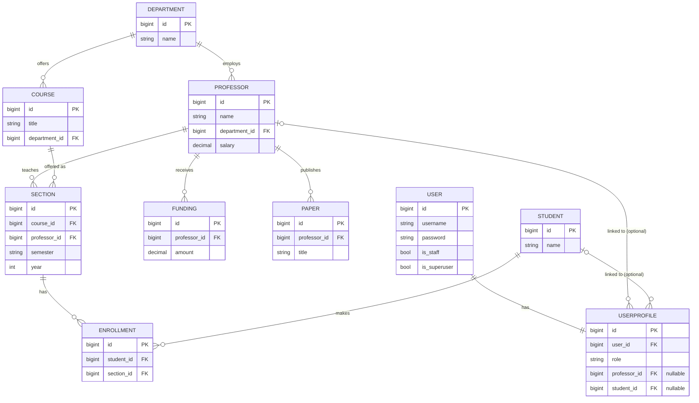

# University Management System — Design Manual

## 0. Project Scope & Deliverables

This project follows the assignment specification transcribed in
[`docs/PROJECT_SPECIFICATION.md`](docs/PROJECT_SPECIFICATION.md), which also
includes a full requirements traceability table. In summary:

- The system supports three roles — admin, professor, and student — through
  features **F1** (professor roster), **F2** (salary table), **F3**
  (professor performance), **F4** (a professor's own sections), **F5** (a
  section's student roster), and **F6** (student course search).
- The assignment's deliverable 4.a scopes the *required minimum*
  implementation as "F1 to F6 **except F3**." This codebase goes beyond that
  minimum and implements F3 (Performance) as well, since it's part of the
  original feature list under "Admin."
- F1, F4, and F5 are worded as "**Create** a list/the list of ...", which the
  spec uses for two distinct things: producing the report page itself, *and*
  creating the underlying records that populate it. This system implements
  both readings — each of those three pages pairs its report with a form
  that inserts a new record: **Add Professor** (F1), **Create Section**
  (F4), and **Enroll Student** (F5). F2 ("create a table") and F6 ("query")
  use different verbs and remain read-only, matching their wording.
- Per the assignment's "Additions," this is an **individual assignment**
  done as a small work project rather than a team project; deliverables that
  only make sense for a team (team formation/lead, in-class showcase
  presentation) do not apply here.

## 1. Design Overview

The system is a Django web application backed by a MySQL database
(`university_db`). Django's ORM translates Python model classes
(`core/models.py`) into MySQL tables and back into Python objects, so no raw
SQL is written anywhere in the application.

**Request flow:** a browser sends an HTTP request to a URL. Django's URL
router (`ums/urls.py`, which delegates to `core/urls.py`) maps that URL to a
Python view function in `core/views.py`. The view queries the database
through the ORM, builds a context dictionary, and renders an HTML template
from `core/templates/core/`. The rendered HTML is sent back to the browser.
All templates extend a shared `base.html`, which pulls in Bootstrap from a
CDN for styling and shows a logout link when a user is signed in.

**Role-based login:** Django's built-in `auth_user` table handles
credential storage and password hashing. A separate `UserProfile` model
(`core/models.py`) extends every user with a `role` field (`admin`,
`professor`, or `student`) and an optional link to a `Professor` or
`Student` record, connecting a login account to the academic data it's
allowed to see.

- `login_view` (`core/views.py`) handles the login form: on `POST`, it
  calls Django's `authenticate()` and, if valid, `login()` to start a
  session, then redirects to `/dashboard/`. On failure it re-renders the
  form with an error message.
- `dashboard` reads the logged-in user's `UserProfile.role` and shows
  links only to the features that role can use.
- Every feature view is wrapped in a custom `role_required(*roles)`
  decorator (`core/decorators.py`) that stacks Django's `@login_required`
  with a role check, so a request from the wrong role never reaches the
  database query — it's rejected with a 403 before any data is touched.
- **Record creation.** The three views whose spec wording is "Create ..."
  (F1, F4, F5) each accept `POST` in addition to `GET`, on the same URL:
  a `GET` renders the report and an empty creation form; a `POST` validates
  the form and, if valid, inserts the record and redirects back to the same
  page (POST/redirect/GET, so refreshing the result page never resubmits
  the form). The forms themselves are Django `ModelForm`s in `core/forms.py`
  (`ProfessorForm`, `SectionForm`, `EnrollmentForm`), which restrict each
  dropdown to real foreign-key choices (departments, courses, students) so
  invalid IDs are rejected before they reach the database.
- **F3 (Performance) aggregation.** `professor_performance` scopes "course
  sections taught" and "students taught" to the chosen academic year and
  semester (`Section.objects.filter(professor=..., year=..., semester=...)`),
  since those are the two metrics the spec ties to "during the semester."
  "Students taught" is a *distinct* count of students across those
  sections (`Enrollment.objects.filter(section__in=sections).values(
  "student").distinct().count()`), so a student enrolled in two of the
  professor's sections that same semester is only counted once. Funding
  secured and papers published are not scoped to the semester — the
  `Funding` and `Paper` models have no date field, and the spec doesn't
  qualify those two metrics with "during the semester" the way it does for
  sections and students — so they're read as career totals for the
  professor.

## 2. E-R Diagram and Database Schemas

### Table descriptions

| Table | Columns | Relationships |
|---|---|---|
| `Department` | `id`, `name` (varchar) | Parent of `Professor` and `Course` |
| `Professor` | `id`, `name` (varchar), `department_id` (FK), `salary` (decimal 10,2) | Belongs to one `Department`; teaches many `Section`s; has many `Funding` and `Paper` records; optionally linked from one `UserProfile` |
| `Student` | `id`, `name` (varchar) | Has many `Enrollment`s; optionally linked from one `UserProfile` |
| `Course` | `id`, `title` (varchar), `department_id` (FK) | Belongs to one `Department`; offered as many `Section`s |
| `Section` | `id`, `course_id` (FK), `professor_id` (FK), `semester` (varchar), `year` (int) | A specific offering of one `Course`, taught by one `Professor`, in a given semester/year; has many `Enrollment`s |
| `Enrollment` | `id`, `student_id` (FK), `section_id` (FK), unique together on (`student_id`, `section_id`) | Join table connecting one `Student` to one `Section`; the uniqueness constraint prevents the same student from being enrolled in the same section twice |
| `Funding` | `id`, `professor_id` (FK), `amount` (decimal 12,2) | Belongs to one `Professor` |
| `Paper` | `id`, `professor_id` (FK), `title` (varchar) | Belongs to one `Professor` |
| `UserProfile` | `id`, `user_id` (FK, one-to-one), `role` (varchar, choices: admin/professor/student), `professor_id` (FK, nullable), `student_id` (FK, nullable) | Extends Django's built-in `User` with a role and an optional link to the academic record that account represents |

All foreign keys use `ON DELETE CASCADE` except `UserProfile.professor` and
`UserProfile.student`, which use `ON DELETE SET NULL` — deleting a
`Professor` or `Student` record shouldn't delete the login account tied to
it, just detach the link.

## 3. Security Assurance

- **Authentication on every page.** Every feature view is either decorated
  directly with Django's `@login_required` or with the custom
  `role_required(*roles)` decorator, which wraps `@login_required` itself.
  An anonymous request to any feature URL (e.g. `/roster/`) is redirected
  to the login page with a `?next=` parameter so the user lands back on the
  page they wanted after signing in.
- **Role checks before data access.** `role_required` reads the requesting
  user's `UserProfile.role` and raises `PermissionDenied` (Django's built-in
  403 response) before the view body — and therefore any database query —
  runs, if the role doesn't match. This is enforced by automated tests for
  every feature (see `core/tests.py`), not just assumed from the code.
- **Object-level ownership, not just role.** F5 (Section Roster) further
  restricts professors to their own sections: `section_roster` filters with
  `get_object_or_404(Section, pk=section_id, professor=professor)`, so
  substituting another professor's section ID in the URL returns 404
  rather than leaking that section's roster — or letting a professor enroll
  a student into a section they don't teach. This is covered by
  `SectionRosterViewTests.test_cannot_view_another_professors_section` and
  `test_cannot_enroll_student_into_another_professors_section`. Likewise,
  creating a section (F4) never takes a professor ID from the request —
  `my_sections` always sets `section.professor` to the logged-in professor
  server-side, so a professor cannot create a section credited to someone
  else.
- **Server-side validation on every create.** `ProfessorForm`, `SectionForm`,
  and `EnrollmentForm` (`core/forms.py`) are Django `ModelForm`s, so invalid
  input (a blank name, a non-numeric salary, a department/course/student ID
  that doesn't exist) is rejected with a form error and nothing is written
  to the database. `EnrollmentForm` additionally excludes students already
  enrolled in the target section from its dropdown, and the `Enrollment`
  model's `unique_together` constraint enforces that same rule at the
  database level as a second line of defense.
- **CSRF protection.** Django's `CsrfViewMiddleware` is active by default
  (see `MIDDLEWARE` in `ums/settings.py`), and every form in the templates
  includes ``, so cross-site form submissions are rejected.
- **No raw SQL.** Every database access in the app goes through the Django
  ORM (`Model.objects...`), which parameterizes queries automatically and
  eliminates SQL injection as an attack vector.
- **Password storage.** Passwords are never stored or compared in plain
  text. Django's `auth_user` table stores a salted PBKDF2 hash, and
  `authenticate()`/`set_password()` are the only ways the app touches
  passwords.

- **No secrets in version control.** The MySQL password and Django's
  `SECRET_KEY` (used to sign sessions and CSRF tokens) are both read from
  environment variables (`os.environ["MYSQL_PASSWORD"]`,
  `os.environ["SECRET_KEY"]`), populated locally by a `.env` file that is
  listed in `.gitignore` and therefore never committed. A `.env.example`
  placeholder is committed instead, so anyone cloning the repo knows which
  variables to set without ever seeing the real values.
